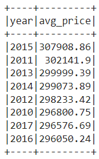
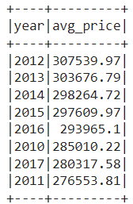

# dabc_challenge_22.big_data
Module 22 - Big Data homework

For this challenge, I used Spark to determine metrics about fictional home sales data over a span of four years. All data engineering and querying can be found in the Home_Sales.ipynb file.

## Data Analysis

Because the dataset had over 33,000 rows, I created a temporary view called home_sales with an added column for year parsed from the date column. Then I ran the following queries against the data using spark.sql. Their results are shown in their respective images.

Q1. What is the average price for a four bedroom house sold per year, rounded to two decimal places?

Q2. What is the average price of a home for each year the home was built, that have 3 bedrooms and 3 bathrooms, rounded to two decimal places?

Q3. What is the average price of a home for each year the home was built, that have 3 bedrooms, 3 bathrooms, with two floors, and are greater than or equal to 2,000 square feet, rounded to two decimal places?

Q4. What is the average price of a home per "view" rating, rounded to two decimal places, having an average home price greater than or equal to $350,000? Order by descending view rating. 

## Handling Big Data

I used spark.sql to cache the temporary table home_sales, which I used to rerun Q4. This shows that the run time of the cached data is faster than the run time of Q4 against the uncached temporary table.

Next, I partitioned the data by the "date_built" field using the parquet file format and read the formatted data as p_df. When Q4 was run again using the p_df dataframe, the run time improves again. This shows that both caching and partitioning are effective methods of speeding up compute times when analyzing big data sets.